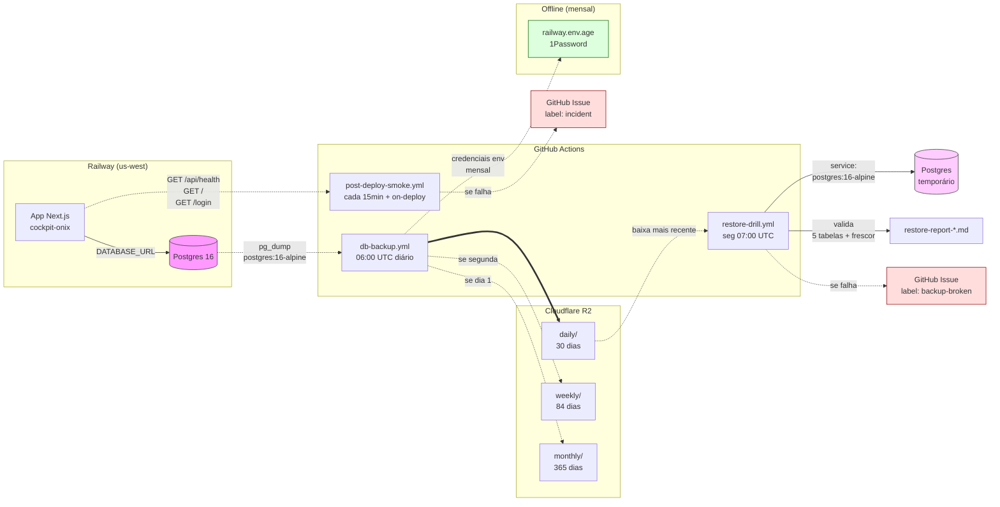

# Arquitetura de Backup — Cockpit Onix

## Diagrama

## Regra 3-2-1-1-0 aplicada

A regra do Veeam, adaptada para o nosso contexto:

| Item | Significado | Como o Cockpit Onix atende |
|------|-------------|----------------------------|
| **3 cópias** | Original + 2 backups | (1) Postgres primary no Railway + (2) Snapshot diário no R2 + (3) PITR do Railway (manual) |
| **2 mídias** | Não pôr tudo no mesmo tipo de storage | Block storage (Railway volume) + Object storage (Cloudflare R2) |
| **1 offsite** | Pelo menos 1 cópia fora do site primário | R2 está em outro provedor (Cloudflare ≠ Railway), em outra região |
| **1 imutável** | Pelo menos 1 cópia que não pode ser sobrescrita | Lifecycle rules do R2 com `Object Lock` opcional (configurar manual) + objetos versionados (write-once) |
| **0 erros** | Validar restore | `restore-drill.yml` faz `pg_restore` real toda segunda + valida com SQL |

### Onde estamos curtos hoje

- **Imutabilidade fraca:** o token R2 tem `Write` permission, então em
  teoria poderia sobrescrever. Para chegar em "imutável de verdade",
  habilitar Object Lock no bucket R2 ([docs Cloudflare](https://developers.cloudflare.com/r2/buckets/object-lock/)).
- **PITR do Railway não está ligado:** custa ~US$ 5/mês, vale a pena para
  reduzir RPO de 24h pra ~5min.

## Custos estimados mensais

Premissas: dump bruto do Postgres ≈ 200 MB hoje, crescendo ~50% ao ano.
Comprimido (gzip -9) ≈ 50 MB. Cenário pra 12 meses pra frente: ~100 MB
por dump.

### Cloudflare R2

| Item | Cálculo | Custo |
|------|---------|-------|
| Storage (30 diários × 100 MB + 12 semanais × 100 MB + 12 mensais × 100 MB = ~5,4 GB) | 5,4 GB × US$ 0,015/GB-mês | **US$ 0,08/mês** |
| Class A operations (PUT/LIST: ~3 PUTs/dia + ~30 LISTs/mês = ~120/mês) | Free tier cobre primeiro 1M | **US$ 0** |
| Class B operations (GET/HEAD: ~10/mês do drill) | Free tier cobre 10M | **US$ 0** |
| Egress (bytes lidos do R2) | R2 não cobra egress | **US$ 0** |
| **Subtotal R2** | | **~US$ 0,08/mês** |

Free tier do R2: 10 GB storage + 1M Class A + 10M Class B grátis para
sempre. **Provavelmente vamos rodar inteiro no free tier por uns 2 anos.**

### GitHub Actions

| Item | Cálculo | Custo |
|------|---------|-------|
| `db-backup.yml` (1×/dia × ~5min) | 30 × 5 = 150 min/mês | incluído |
| `restore-drill.yml` (1×/sem × ~10min) | 4 × 10 = 40 min/mês | incluído |
| `post-deploy-smoke.yml` (cada 15min × ~30s + deploys) | (4 × 24 × 30) × 0,5 = 1.440 min/mês ≈ 24h | incluído ⚠️ |
| `cron.yml` (existente — vários crons) | já contabilizado | incluído |
| **Subtotal Actions** | | **US$ 0** (plano grátis tem 2.000 min/mês para repos privados; públicos é ilimitado) |

> ⚠️ Se o repo virar privado, o smoke a cada 15min vira o maior consumidor
> de minutos. Reduzir frequência ou mover pra uptime monitor externo
> (Uptime Kuma, StatusCake) elimina o problema. Veja
> [docs/SECRETS.md](./SECRETS.md) para detalhes.

### Total geral

**~US$ 0,08/mês** (ou US$ 0 se o repo permanecer público no GitHub).

### Custo se ligar Railway PITR

Estimativa Railway: ~US$ 5/mês para Postgres com PITR (depende do volume).
Vale a pena pra cair RPO de 24h pra ~5min.

**Total com PITR:** ~US$ 5,08/mês.
